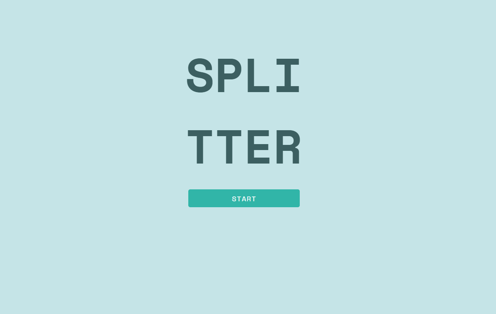
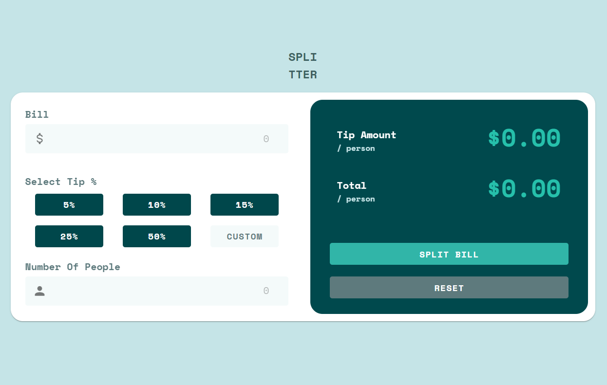

# Frontend Mentor - Tip Calculator App Solution

This is a solution to the [Tip calculator app challenge on Frontend Mentor](https://www.frontendmentor.io/challenges/tip-calculator-app-ugJNGbJUX). I Like working on these challanges to grow as a developer.

## Table of contents

- [Start Project](#start-project)
- [Overview](#overview)
  - [The challenge](#the-challenge)
  - [Screenshot](#screenshot)
  - [Links](#links)
- [My process](#my-process)
  - [Built with](#built-with)
  - [What I learned](#what-i-learned)
  - [Useful resources](#useful-resources)
- [Author](#author)

**Note: Delete this note and update the table of contents based on what sections you keep.**

## Start Project

    - git pull https://github.com/Makita7/Tip-Calculator.git
    - pnpm i
    - pnpm run dev

## Overview

### The challenge

Users should be able to:

- View the optimal layout for the app depending on their device's screen size
- See hover states for all interactive elements on the page
- Calculate the correct tip and total cost of the bill per person

### Screenshot

### Links

- Solution URL: [LINK](https://www.frontendmentor.io/solutions/vue-3-tip-calculator-kfHrkUiWkY)
- Live Site URL: [LINK](https://makita7.github.io/Tip-Calculator/)

## My process
    In general I try to map out the layout with mock data and then I start building the actual methods to make it work.
### Built with

- HTML5 markup
- SCSS custom properties
- [Vuetify 3 + Vite](https://vuetifyjs.com/en/) - Component Framework
- [Vue JS](https://vuejs.org/) - JS Library
- [PNPM](https://pnpm.io/) - Package Manager

### What I learned

I did this project with the intent of learning:
    - How to customize Vuetify 3 Components
    - Practicing basic JS
    - Basic CSS Animations

**Note: Delete this note and the content within this section and replace with your own learnings.**

### Useful resources

- [CSS Animations](https://developer.mozilla.org/en-US/docs/Web/CSS/CSS_animations/Using_CSS_animations) - This helped me understand CSS Animations with keyframes better
- [Vuetify Theme Customizing](https://vuetifyjs.com/en/features/theme/) - This Documentation helped with the customizing of the theme
- [Installing SCSS for Vue 3](https://medium.com/devops-techable/speed-up-your-vue-3-application-with-scss-and-external-style-files-350fb2548745) - I was having trouble with using SCSS inside of Vue and this helped me

## Author

- Frontend Mentor - [@Makita7](https://www.frontendmentor.io/profile/Makita7)
- GitHub - [@Makita7](https://github.com/Makita7)

